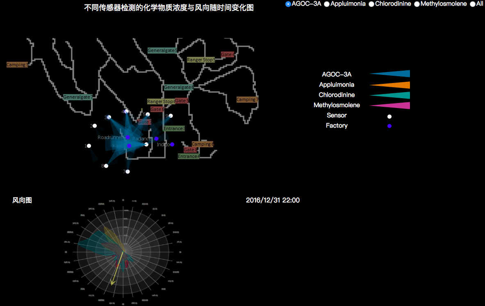
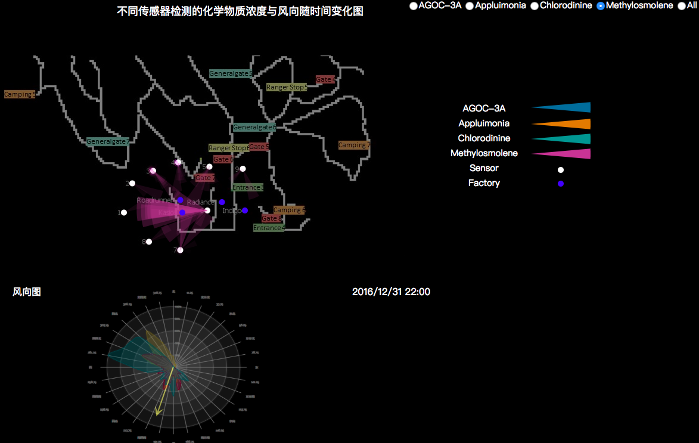
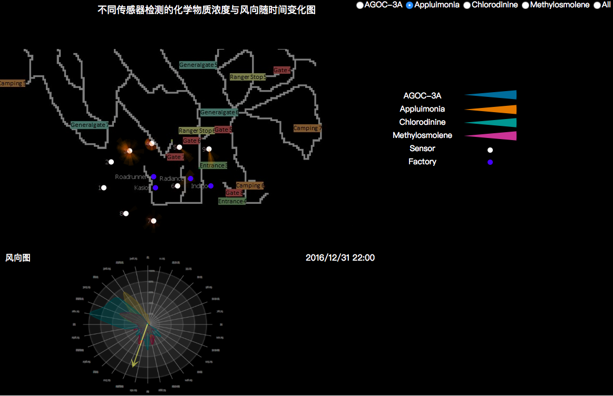
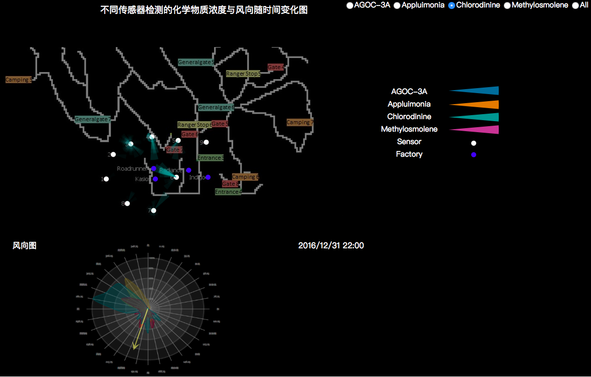
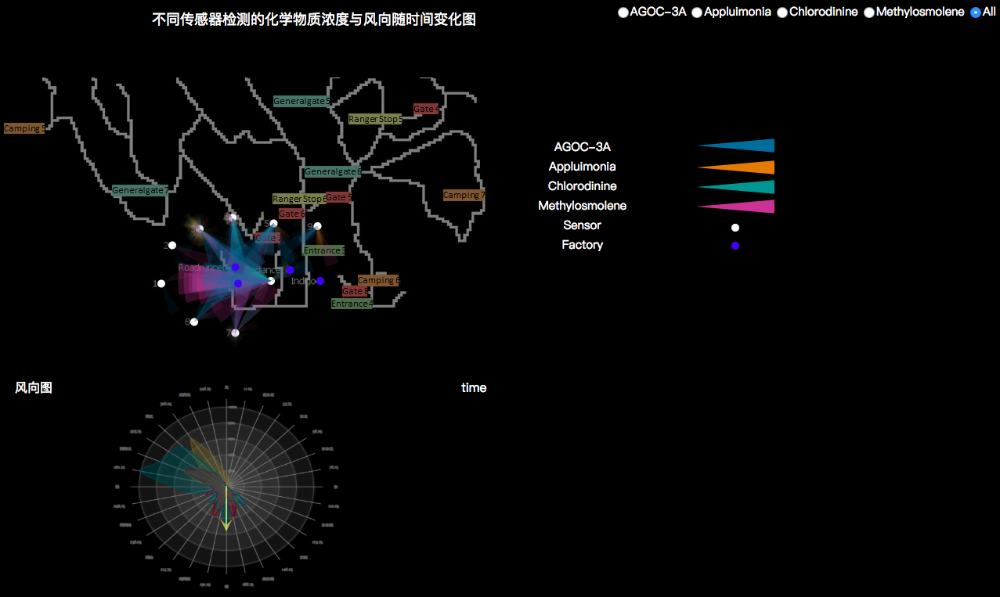

### ReadMe

- 由于没有做优化，并且我们将大部分数据进行了可视化分析，因此该动画可能需要加载一段时间，请耐心等待。

- 其中右上角的选择栏可选择检测哪一种化学物质，下方的风向图反映了当时的风向，而时间文本则直接反映时间。

- 地图中有9个传感器和4个工厂，其中传感器所接受到的小扇形区域为污染物，颜色深浅和半径大小共同决定污染物的浓度大小，以半径大小为主要参量，颜色深可能是由于含量小的数据点过多所造成，需要人为判断筛选。

- 选择All之后由于数据量过大，浏览器可能多次卡顿，等待较长时间后能够看到结果。

- 浏览器由于安全性对于本地文件的读取会出现错误，因此要设置相关参数才能够正确读取本地csv文件从而看到动画效果。

  

### Demo

