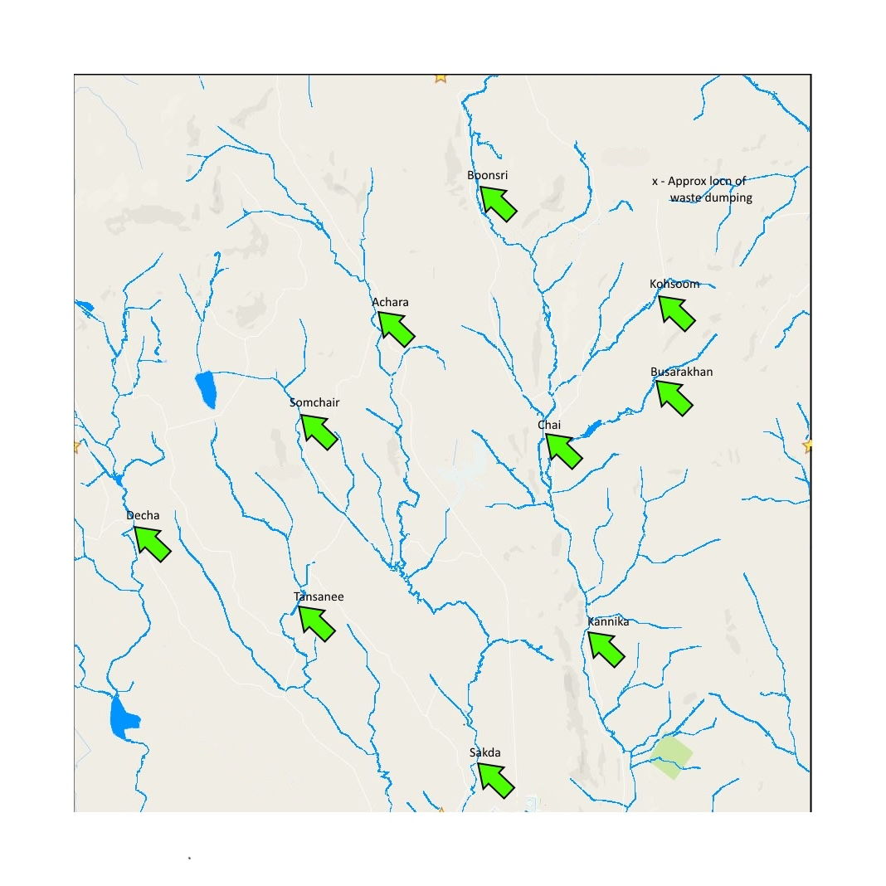

### Challenge3

在过去的多次调研中，我们发现有公司在野生动物保护区中倾倒有害物质。但所有公司都否认自己在倾倒有害物质，而且还反诬陷研究人员在栽赃他们。米斯福德大学的教授非常生气，他决定自己亲自前往调研，但是却发现保护区内好多处土壤被运进来的新土壤覆盖了。

还好，米斯福德大学水文研究所的教授推荐，可以通过分析过去几年的水文数据来进而研究土壤污染情况。保护区的水文传感器分布在保护区的不同地点，并且包含了可能感兴趣的化学物质的测量指标。

数据格式如下：

测量数据：

| id   | value | location | sample date | measure           |
| ---- | ----- | -------- | ----------- | ----------------- |
| 2221 | 2     | Boonsri  | 11-Jan-98   | Water temperature |

测量方法的单位：

| measure                | unit |
| ---------------------- | ---- |
| 1,2,3-Trichlorobenzene | ug/l |

<u>报告需要回答但不限于以下的问题</u>：

1. 刻画自然保护区内的水污染的状况（包括过去和现在）
2. 在采样数据中，你发现了什么异常？这些异常的原因可能是？
3. 采集到的数据是否足以了解保护区的综合情况？如果不行，你建议增加怎么样的采样方法，或者如何改进采样方法？