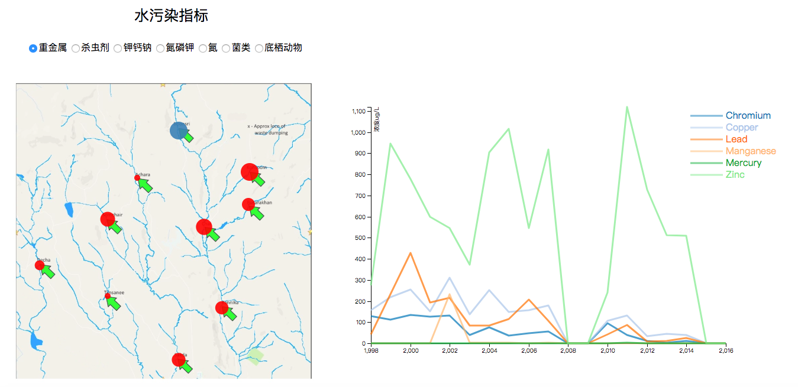

### ReadMe

- 浏览器请使用Chrome
- 浏览器打开 水污染指标.html 即可浏览水污染指标的交互效果，由于需要读取csv文件，浏览器安全性需要进行设置。
- 打开文件后，左上方为物质种类选取栏，选择不同物质可以在地图上看到该区域该种类物质的累积浓度状况，以圆点半径大小来encoding，而折线图反映了区域年平均浓度的变化情况。
- 将光标移至区域上不同检测点，右方折线图变化，具体反映该检测点所选类别中具体物质的年累积浓度变化情况。
- 选择“氮”时，由于数据量比较大，可能会有一点卡顿。

### Demo

