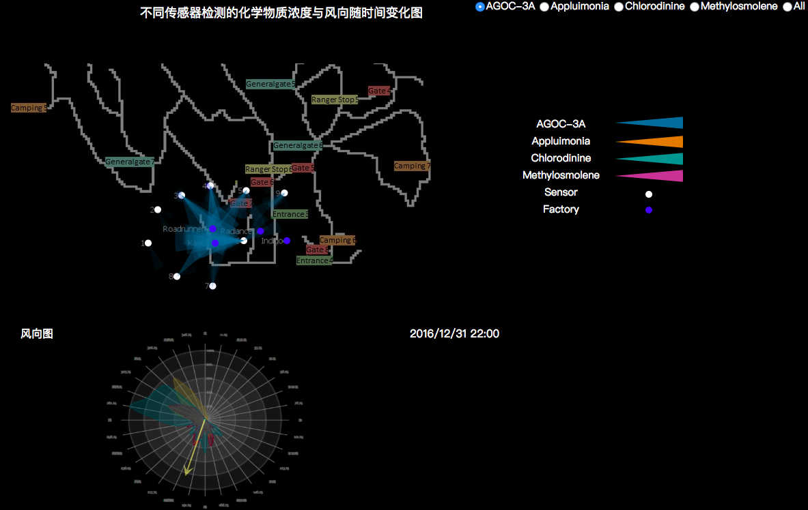
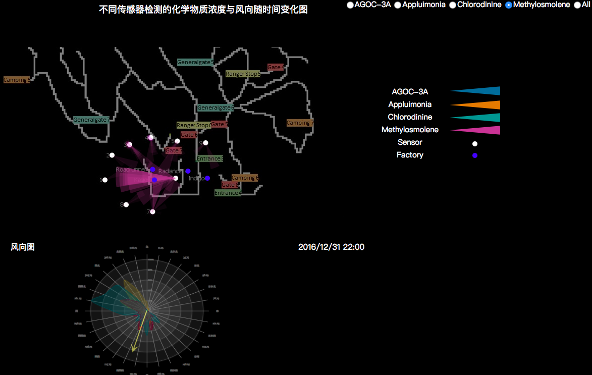
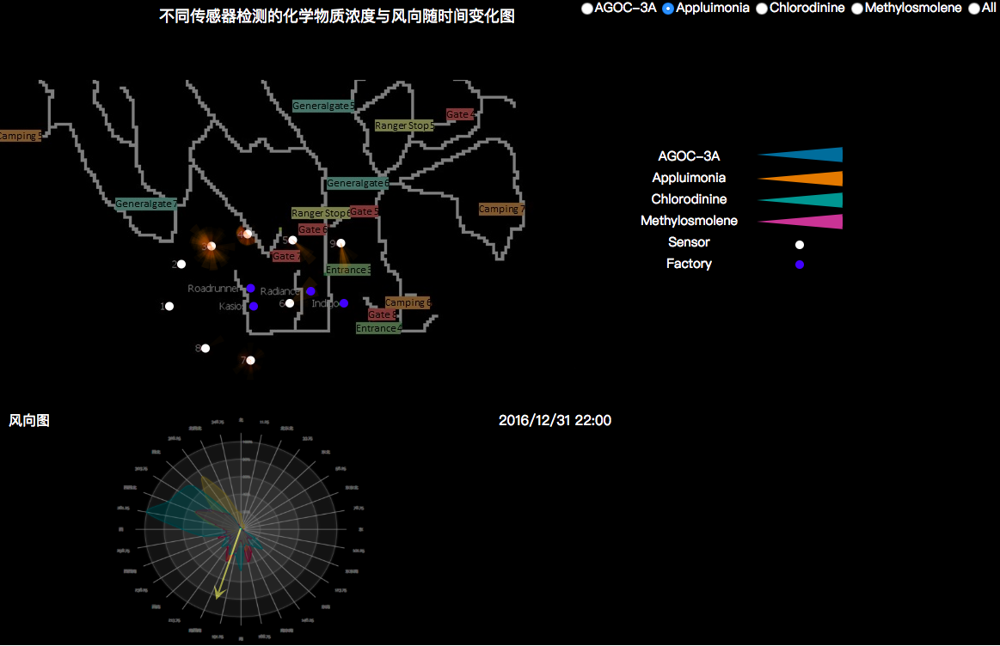
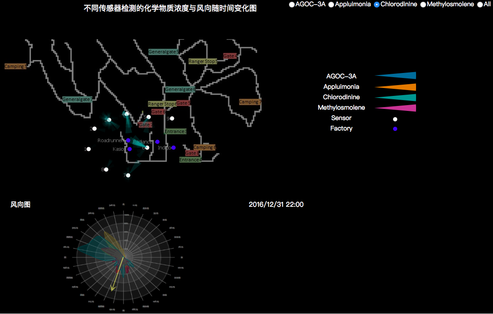
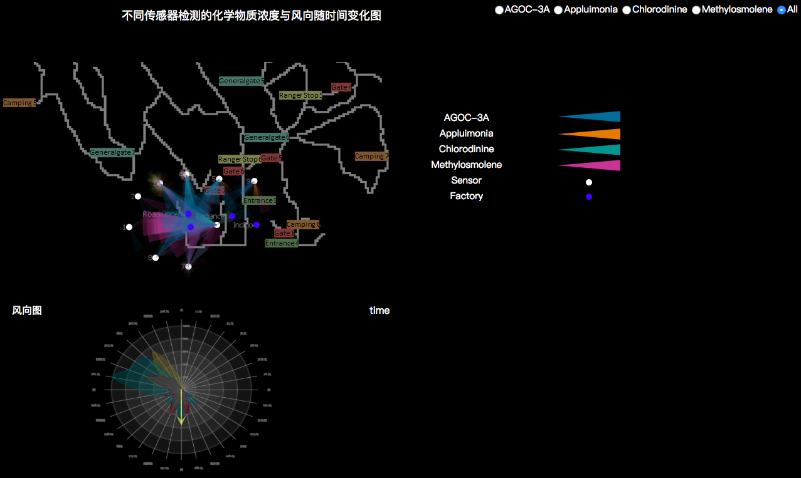
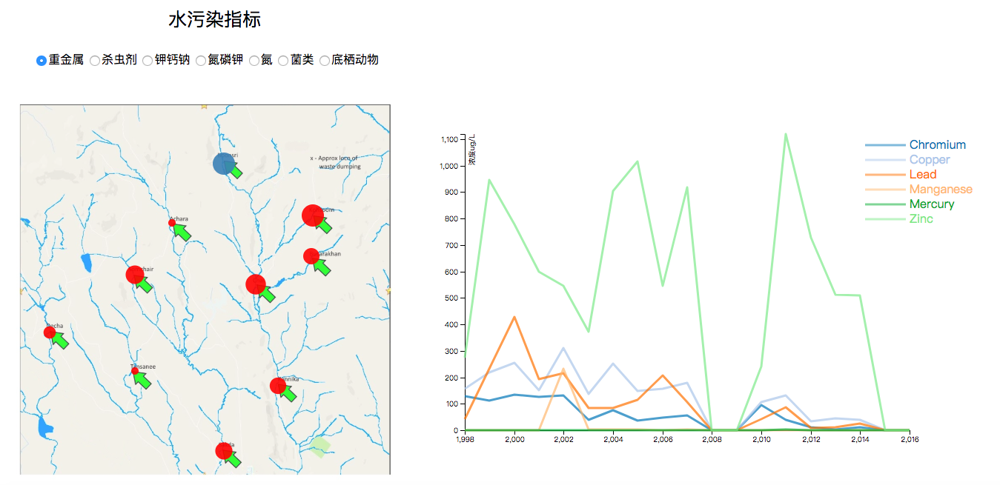

# VisualAnalytics
## Introduction

This repository records notes and homework(only core graph or cartoon) of zju2018 visual analytics summer school. 

## Demo

### challenge2

### challenge3

## What's included

You can see the source code in the challenges folder, demo.mp4  in the video folder, demos in the pictures folder.

## Library Support

D3.js

## Notice

If you open src.html on the Web brower Chrome, face the problem **"Cross origin requests are only supported for protocol schemes: http, data, chrome, chrome-extension, https."**  in the console and cannot see the cartoon， you may be limited by your web security.

For Mac users, you can type `open -n /Applications/Google\ Chrome.app/ --args --disable-web-security  --user-data-dir=/Users/yourname/MyChromeDevUserData/  `*(where yourname is replaced by your PC name )* in the terminal to open such browser to see the cartoon.

